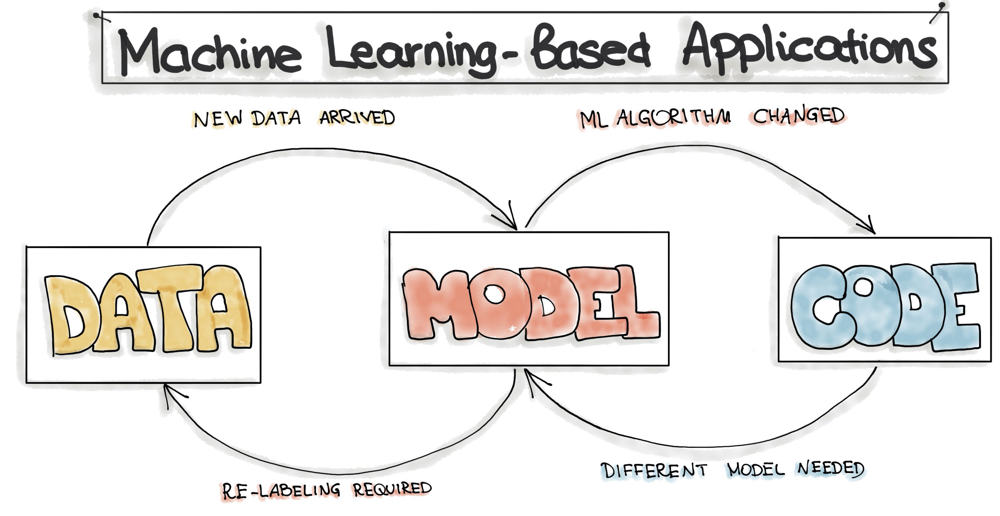

# Introduction

## Why MLOps?

::: notes

MLOps only became popular fairly recently, as you can see in the Google Trends graph.

:::

## Why MLOps?

::: notes

One of the biggest challenges in ML is to get the model into production. D. Sculley et al. (2015)
found that the code for the ML code is only a fraction of the code in an ML system. The rest of
the code is for data collection, data cleaning, data preparation, data storage, model training,
model evaluation, model deployment, model monitoring, and model retraining.

Many companies struggle with deploying and monitoring ML models in production. This is why MLOps
is becoming a critical component of successful ML projects.

:::

## Why MLOps?

- **New** field, daily evolution
- ML model design is *relatively* easy
- ML model in production is *much* harder, time-consuming

## References

- Google Trends: [MLOps](https://trends.google.com/trends/explore?date=all&q=MLOps)
- Sculley, D., Holt, G., Golovin, D., Davydov, E., Phillips, T., Ebner, D., ... & Dennison, D. (2015).
[Hidden technical debt in machine learning systems](https://proceedings.neurips.cc/paper_files/paper/2015/hash/86df7dcfd896fcaf2674f757a2463eba-Abstract.html).
Advances in neural information processing systems, 28.

# Machine Learning Operations

## Machine Learning Operations

> Standardization and streamlining of machine learning life cycle management:
> development, testing, deployment, and monitoring.

 

- Aka **MLOps**
- Don't confuse with ModelOps or AIOps

::: notes

- ModelOps:
  - is a more general term than MLOps
  - deploy any kind of model (e.g. a rule-based model)
  - includes MLOps
- AIOps:
  - solve operational issues with AI
  - e.g. predict network problems so that a DevOps team can act faster or even before the problem occurs

:::

## Three levels of change

::: notes

Source: <https://ml-ops.org/content/motivation>

:::

TODO: nog verder aanvullen met intro MLOps

# Study Guide

## Study Guide

See Chamilo course for detailed information.

## Course within the curriculum

TODO: afbeeldingen curriculum of evt. een klein diagram maken

