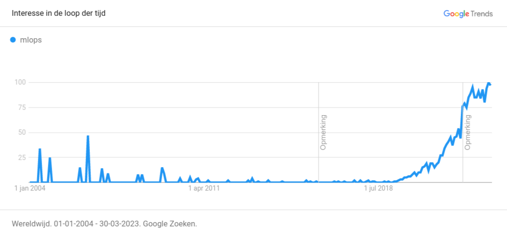
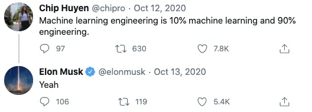
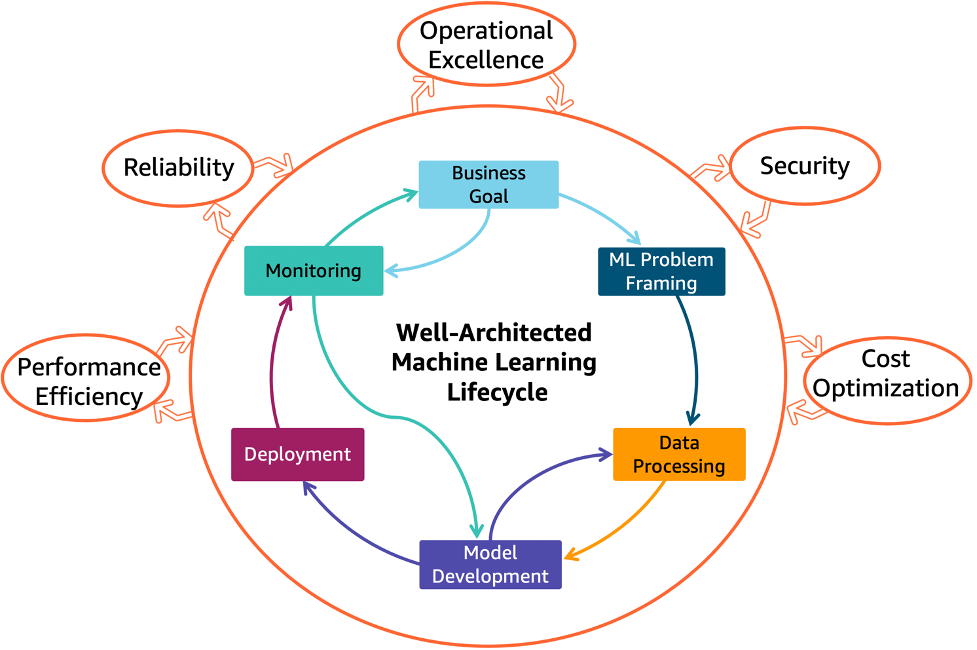
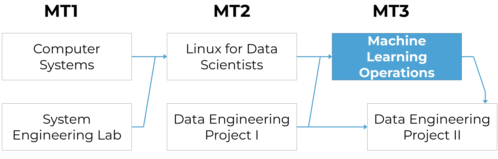

# Introduction

## Why MLOps?



## Why MLOps?


::: notes

One of the biggest challenges in ML is to get the model into production. D. Sculley et al. (2015)
found that the code for the ML code is only a fraction of the code in an ML system. The rest of
the code is for data collection, data cleaning, data preparation, data storage, model training,
model evaluation, model deployment, model monitoring, and model retraining.

Many companies struggle with deploying and monitoring ML models in production. This is why MLOps
is becoming a critical component of successful ML projects.

:::

## Why MLOps?



## Why MLOps?

- **New field**, daily evolution
- ML model design is *relatively* easy
- ML model in production is *much* harder, time-consuming

## More than deploying models

- Data versioning
- Prevent bad models from being deployed
- Monitoring performance
  - Model regression, data drift, model drift...
- Availability
- ...

## Best practices

- Modularity of ML steps
- Containerization
- Versioning (data and models)
- Mixed, autonomous teams (~ DevOps)
- Peer reviews, peer reviews, peer reviews...

## References

- Google Trends: [MLOps](https://trends.google.com/trends/explore?date=all&q=MLOps)
- Tweet: [Chip Huyen](https://twitter.com/chipro/status/1305898767980536832)
- Sculley, D., Holt, G., Golovin, D., Davydov, E., Phillips, T., Ebner, D., ... & Dennison, D. (2015).
[Hidden technical debt in machine learning systems](https://proceedings.neurips.cc/paper_files/paper/2015/hash/86df7dcfd896fcaf2674f757a2463eba-Abstract.html).
Advances in neural information processing systems, 28.
- Degroote, S. (2021). [MLOps 101 - What, why and how to get started today](https://blog.ml6.eu/mlops-101-what-why-and-how-to-get-started-today-1f2d4038662c)

# ML lifecycle

## ML lifecycle



## Business goal

- Solve a real problem
- Goal: create real (business) value

## ML problem framing

How could ML help? Is ML needed at all?

- No? Don't use ML!
- Yes? What kind of ML problem is it?
  - Structured data problem?
  - NLP problem?
  - Computer vision problem?
  - Multi-modal problem?
  - ...

## Data processing

We need data, but

- How do we get the data?
- How do we store the data?
- Where do we store the data?
- How long do we store the data for?
- ...

Once we have the data, we need to think about what we'll do with it (exploration, annotation...)

## Model development

- What model do we use?
  - What are the requirements?
- Where do we get the model from?
  - Are we allowed to use the model? (licensing)
- How do we train the model?
- How do we keep track of the parameters used?
- How do we store the model?

**The model is only a small part of the ML system!**

## Deployment

We have a model, now what? Let's deploy it!

- Who needs access?
- What do we need?
  - Batch?
  - Real-time?
  - Serverless?
- What usage do we expect?
- ...

## Monitoring

The model is deployed, but we're not done yet!

- Is the infra still running?
- How do we know if the model is performing well?
  - Model drift
  - Data drift
  - ...
- How do we know if the model is used correctly?
- Does the model solve the business problem?

## Conclusion

- It is complex
- Requires some organization & automation
  - Multiple people involved
  - Multiple datasets
  - Multiple models
  - All used at the same time
- = **MLOps**

# Machine Learning Operations

## Machine Learning Operations

> Standardization and streamlining of machine learning life cycle management:
> development, testing, deployment, and monitoring.

<br/>

- Aka **MLOps**
- Don't confuse with ModelOps or AIOps

::: notes

- ModelOps:
  - is a more general term than MLOps
  - deploy any kind of model (e.g. a rule-based model)
  - includes MLOps
- AIOps:
  - solve operational issues with AI
  - e.g. predict network problems so that a DevOps team can act faster or even before the problem occurs

:::

# Study Guide

## Study Guide

See Chamilo course for detailed information.

## Course within the curriculum



## Learning goals and competences

- **CI/CD principles** in the context of ML
- Bring a ML model into **production** and **monitor** it using CI/CD principles
- Describes the challenges and possible solutions for running a ML model on devices with
limited computing power
- Run a ML model on a device with **limited computing power**, e.g. using Tensorflow Lite

<br/>
<br/>
<center>**Remark: this is a new course**</center>

## Course contents

- CI/CD pipelines
- Docker, Kubernetes, Kubeflow
- Azure Machine Learning
- Metadata and artifacts
- Monitoring and logging

## Learning materials

- Start with the overview in the Chamilo course
- GitHub: [lecture slides](https://hogent-mlops.github.io/mlops-slides/), [lab assignments](https://github.com/HOGENT-MLOps/mlops-labs)
- Online manuals of software used
- Video recordings of classroom instruction (Dutch)
- (Books - see study guide on Chamilo)

## Software needed

```console
PS> choco install git
PS> choco install vscode
PS> choco install virtualbox
PS> choco install vagrant
```

(macOS, Linux: see course overview on Chamilo)

## Software (continuation)

- VSCode: install recommended plugins (see course overview)
- VirtualBox: Extension Pack!
- Git client: also install Git Bash!
- Ansible: only Linux and macOS

## Azure for Students

Who still has an Azure for Students subscription?


## Teaching methods

- Classroom instruction, demonstration
- Lab assignments
- Guest lecture

## Tutoring

- Individual guidance for lab assignments
- Ask questions *during class sessions*
- Outside class: *general Teams channel*
- Only for personal questions: *e-mail/Teams chat*

## Semester schedule

1. intro, software install, M1. Docker
2. M2. CI/CD pipelines
3. (continued)
4. M3. The ML Workflow (guest lecture)
5. (continued)
6. (continued)

## Semester schedule

<!-- markdownlint-disable ol-prefix -->
7. M4. Kubernetes
8. (continued)
9. M5. Kubeflow
10. (continued)
11. M6. Monitoring and logging
12. (continued)
13. Optional: catch-up session
<!-- markdownlint-enable ol-prefix -->

## Assessment

- **Portfolio**:
  - Github repo with source code and reports
- **Demonstrations**:
  - During the semester (at least 3x)
  - End result (exam period or W13)

## Resit

Personal assignment, no support

- finish lab assignments
- extra assignment

## Questions?

- Ask questions during class hours
- Use Teams channel
