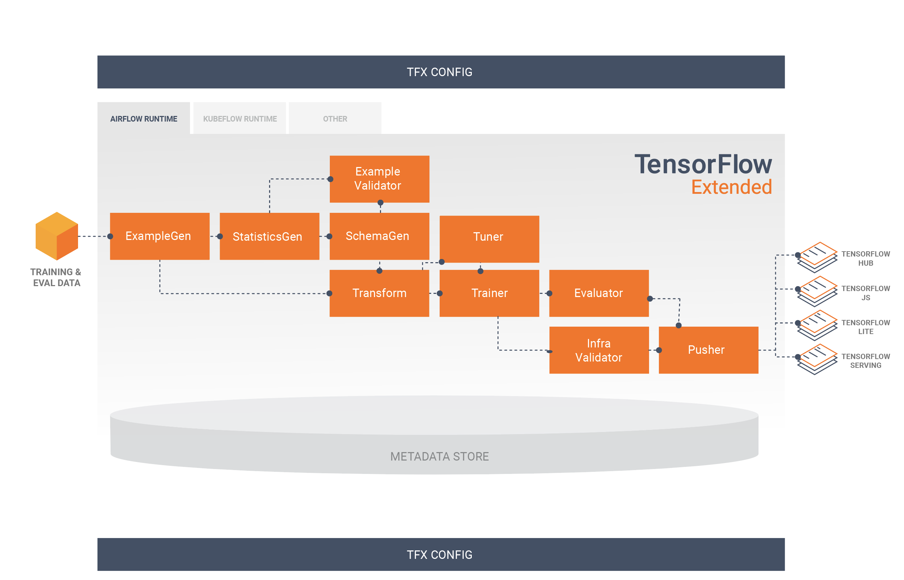
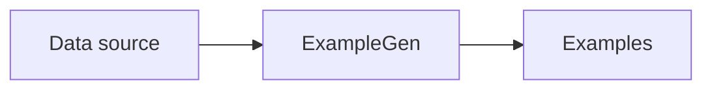

<!--

Mogelijke inhoud:

- Intro
- Opbouw van een TFX-pipeline (ExampleGen, StatisticsGen, ...)
- Model analysis
- Model validation
- Model versioning
- Artifact, metadata store
- Services die TFX gebruiken (in de cloud?)

-->

# TensorFlow Extended

## Introduction

- Development &ne; production
  - Dev: scikit-learn, Jupyter...
  - Prod: NodeJS, TFX, Kubeflow...
- Ideally: same code, different configuration
  - Sometimes same vendor, same cloud, same tools
  - Sometimes not possible

> Think about your tools even before you start coding!
> A good toolset can save you a lot of time and effort.

## Considerations

- Tooling
  - impact on model
  - effort to put in in prod
  - output format of ML model (PMML, ONNX...)
  - ...
- Performance
  - Python vs C++
  - must run on a low end device vs high end server

## Considerations

- Data access
  - bundled with model (= frozen data)
  - database, cloud storage... (= dynamic data)
  - prod env should have access, correct drivers...
- Training vs inference
  - training: most expensive step in ML lifecycle
  - inference: most of time spent here in prod
  - think about how to optimize both
  - do not over engineer the model

::: notes

<b><u>Example for data access</u></b>

A model evaluating apartment prices may use the average market price in a zip code area.
However, the user or the system requesting the scoring will probably not provide this
average and would most likely provide simply the zip code, meaning a lookup is necessary
to fetch the value of the average.

:::

# Model risk evaluation

## Model evaluation

- Model mimics reality, but is imperfect
- Malfunctions or malicious attacks can cause harm

## Questions to ask

Questions to ask before deploying a model:

- What is the model acts in the worst imaginable way?
- What if a user manages to extract the training data or the internal logic of the model?
- What are the financial, business, legal, safety, and reputational risks?

## Causes for trouble

- Bugs (your code, runtime framework...)
- Low quality training data
- High difference prod vs training data
- Misuse of model
- Adversarial attacks
- Bias, unethical use
- ...

::: notes

Adversarial attacks:

- malicious attacks on the data which may seem okay to a human eye but causes misclassification
  in a machine learning pipeline. These attacks are often made in the form of specially designed
  "noise", which can elicit misclassification.
- See <https://www.analyticsvidhya.com/blog/2022/09/machine-learning-adversarial-attacks-and-defense>

:::

## Quality assurance

- Does not only occur at the end of the pipeline
- Occurs at every step of the pipeline
- Can be automated with e.g. [TensorFlow Extended](https://www.tensorflow.org/tfx) (= pipelines)

# TensorFlow Extended

## TensorFlow Extended (TFX)

- end-to-end platform for deploying production ML pipelines
- manages the entire ML workflow
- create pipelines via Python API
- see: <https://www.tensorflow.org/tfx>

## TensorFlow Extended (TFX)

- either on-premise or in the cloud
  - Local orchestrator
  - Vertex AI Pipelines (Google Cloud)
  - Apache Airflow (open source)
  - Kubeflow Pipelines (open source)

## TFX components

## Flow between components

## ExampleGen

- ingests data
- various data sources
- generates examples
- consistent and configurable partitioning
- shuffles dataset

## ExampleGen

## StatisticsGen

## SchemaGen

## ExampleValidator

## Transform

## Evaluator

## Pusher

## Model Server

## References

- TensorFlow Extended Guide: <https://www.tensorflow.org/tfx/guide>
