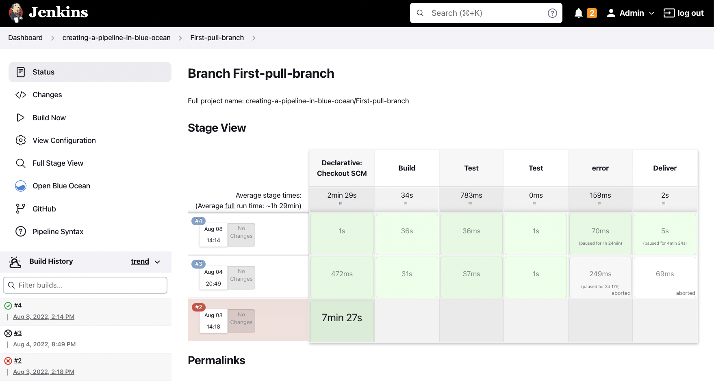
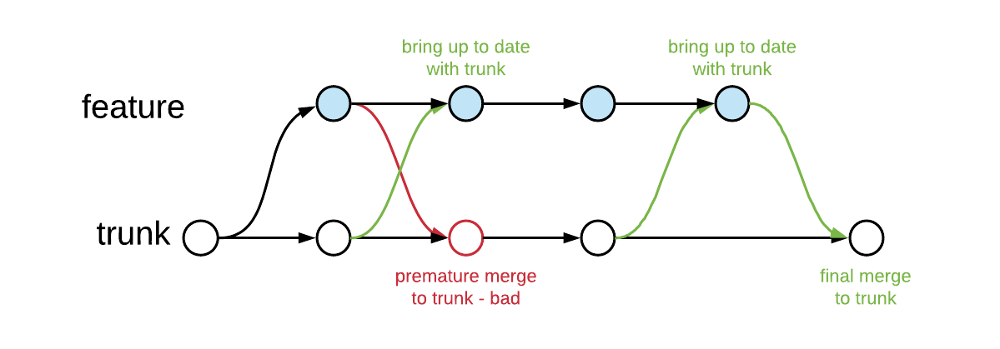

# CI/CD

## Learning goals

- Creating simple actions and workflows
- Running a pipeline to lint the code, and build and push a Docker image

# Intro

## Traditional release

- Weeks/months apart
- Lots of changes!
- ⇒ Lots of bugs...
  - Wait for vN.1?
- Releases are painful, high-risk events

## How e.g. Facebook does it (1)

- "If it hurts, do it more often"
- Dozens of releases per day!
- Small, incremental changes go into production
- ⇒ Reduced risk

## How e.g. Facebook does it (2)


Read more: [Rapid release at massive scale](https://engineering.fb.com/2017/08/31/web/rapid-release-at-massive-scale/)

## Continuous Integration/Delivery


## Continuous Delivery/Deployment


## Typical tasks for CI

- Linting: code style checks
- Static analysis (e.g. shellcheck)
- Compilation
- Unit tests
- Code coverage analysis
- Packaging

## Typical tasks for CD

- Release to package repository
- Deploy in acceptance environment
- Deploy to production
- Integration/acceptance/load-tests...

**But sometimes a human gives the final go-ahead!**

# CI/CD tooling

## Overview

- Open source
  - [Concourse](https://concourse-ci.org/)
  - [Jenkins](https://www.jenkins.io/)
  - [Spinnaker](https://spinnaker.io/)
- Commercial on-prem
  - [Atlassian Bamboo](https://www.atlassian.com/software/bamboo)
  - [Jetbrains TeamCity](https://www.jetbrains.com/teamcity/)

---

- Commercial, hosted
  - [AWS CodePipeline](https://aws.amazon.com/getting-started/hands-on/set-up-ci-cd-pipeline/)
  - [Azure DevOps](https://azure.microsoft.com/en-us/services/devops/)
  - [CircleCI](https://circleci.com/)
  - [Codeship](https://www.cloudbees.com/products/codeship)
  - [GitHub Actions](https://github.com/features/actions)
  - [GitLab CI](https://docs.gitlab.com/ee/ci/)
  - [Travis CI](https://travis-ci.org/)

## Jenkins

<https://www.jenkins.io/>

- Open source
- Mature
- Most flexibility
  - on-prem/private/public cloud
  - rich feature set

---



## GitHub Actions

<https://docs.github.com/en/actions>

- Integrated in GitHub
- CI/CD code alongside the source code
- Free to use (with limitations)
  - Pay-as-you-go after limits are reached

## A GitHub Actions case

This slide deck was built on GitHub Actions & deployed to GitHub Pages!

Check out the source code:

<https://github.com/HOGENT-MLOps/mlops-slides/blob/main/.github/workflows/compile.yml>

## Working with GitHub Actions

- Go to Actions, New workflow
- Or create `.github/workflows/workflow-name.yml`
- [RTFM](https://docs.github.com/en/actions)

## Example workflow

```yaml
---
name: GitHub Actions Demo
run-name: ${{ github.actor }} is testing out GitHub Actions 🚀
on:
  push:
    branches:
      - main
jobs:
  Explore-GitHub-Actions:
    runs-on: ubuntu-latest
    steps:
      - name: Check out repository code
        uses: actions/checkout@v3
      - name: List files in the repository
        run: |
          ls ${{ github.workspace }}
      - run: echo "This job's status is ${{ job.status }}."
```

## Gitlab CI

<https://docs.gitlab.com/ee/ci/>

- Open source
- Integrated in GitLab
- CI/CD code alongside the source code
- Also free with limits

# Deployment techniques

## Canary deployments


## Blue-Green Deployment


## Trunk-based development

- No more `master`/`develop`/`feature` branches
  - Branches considered harmful!
- All work done on `main`
- Short-lived feature branches

## Feature branches



# Get started with the lab assignment!

## Jenkins lab assignment

```console
cd cicdlab
vagrant up
vagrant ssh
```

Follow the steps in the assignment <https://github.com/HOGENT-MLOps/mlops-labs/blob/main/assignment/02-cicd.md>

Jenkins UI resides at <http://192.168.56.20:8080/>

Also keep a cheat sheet of important commands!

## Setup

- Docker and Jenkins running on the VM
- Default installation, minimal configuration required
- Launch demo application in Docker container
- Make change, rebuild & deploy!

# Reflection

## Lab setup vs reality

- Complete build server
  - Physical system or "traditional" VM
  - Worker nodes
- Central repo + build tools

## Change in discipline needed!

- code coverage ⟶ 100%
- [feature flags](https://martinfowler.com/articles/feature-toggles.html)
- [canary deployment](https://martinfowler.com/bliki/CanaryRelease.html)
- [blue/green deployment](https://martinfowler.com/bliki/BlueGreenDeployment.html)
- [trunk-based development](https://martinfowler.com/articles/branching-patterns.html)

<!--

TODO: lab assignment, mogelijks:
- https://learn.microsoft.com/en-us/azure/machine-learning/how-to-github-actions-machine-learning?view=azureml-api-2&tabs=userlevel
- https://github.com/machine-learning-apps/actions-ml-cicd
- https://towardsdatascience.com/automate-machine-learning-deployment-with-github-actions-f752766981b1

TODO: extra referenties:
- https://www.youtube.com/watch?v=Ll50l3fsoYs

TODO: link met TFX pipelines leggen?

-->
