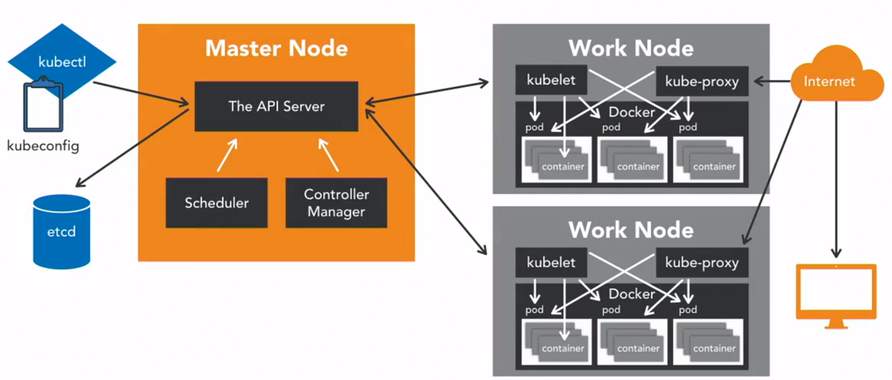

# Container orchestration: Kubernetes

## Learning goals

- Understanding the concept of container orchestration
- Understanding the basic architecture of Kubernetes
- Being able to operate a Kubernetes cluster
  - Applying changes using manifest files
- Being able to manipulate Kubernetes resources
  - Pods
  - Controllers: ReplicaSets, Deployments, Services
  - Organising applications: Labels, Selectors
- Deploying a multi-tier application on a Kubernetes cluster

# A little history

## Deployment (r)evolution

## Why are containers so popular?

- CI/CD: easy to switch to previous versions (= images)
- decouple application from infrastructure
- environmental consistency: runs the same on your pc as in the cloud
- resource isolation: predictable application performance
- resource utilization: high efficiency and density
- ...

## Requirements for containers in production

- Scalability & availability
- Dependencies between containers
  - Load balancer
  - Database/persistent storage
- Multi-host container
- Rolling updates/rollbacks
- ...

**It's complicated!**

## Container orchestration

= tool that allows container management at scale

- Apache Mesos
- Docker Swarm
- Rancher
- Nomad
- Kubernetes - has become "market leader"

# Container orchestration: Kubernetes

## Kubernetes by Google

> Kubernetes (k8s) is an open source project that enables software teams of all sizes, from a small startup to a Fortune 100 company, to automate deploying, scaling, and managing applications on a group or cluster of server machines.
>
> These applications can include everything from internal-facing web applications like a content management system, to marquee web properties like Gmail, to big data processing.
>
> -- Jo Beda (Google)

## Kubernetes architecture

## "Management node"

- Sysadmin interacts with Master Node through `kubectl`
- Settings (host name, credentials, etc): `kubeconfig`
- For example: your pc

## Master Node

- API server
- Scheduler
- Controller Manager
  - Node controller: responsible for worker states
  - Replication controller: maintain correct number of pods for replicated controllers
  - Endpoint controller: join services & pods
  - Service account & token controller: access management
- etcd: key/value store, e.g. scheduling info, node details

## Worker node

- `kubelet`: communicate with Master Node
- Run workloads
  - Container Engine (e.g. Docker, Podman)
  - Pods: smallest unit, tightly coupled containers
- Mount volumes
- Network routing (`kube-proxy`)
- ...

## Basic building blocks

- Pods
- Controllers:
  - Deployments, ReplicaSets, Services
  - Jobs, CronJobs
- Organise applications:
  - Labels, Selectors, Namespaces

## Pods

- Smallest unit of deployment
- (Docker) App container(s)
- Storage resources
- Unique network IP
- Options that govern how container(s) should run

## Pods properties

- Ephemeral, disposable
- Never self-heal, not restarted by scheduler by itself
- Never create pods just by themselves
- Pro-tip: don't use pods directly, but controllers like a deployment

## Pod states

- Pending - k8s accepted Pod but no containers created
- Running - node assigned, all containers are created and at least one is running
- Succeeded - all containers exited with status 0
- Failed - all containers exited, at least one with exit status != 0
- CrashLoopBackOff - container fails to start, k8s tries over and over

## Controllers

- Running applications in controllers has some benefits:
  - Application reliability
  - Scaling
  - Load balancing

## Controllers: ReplicaSets

- Ensure specified number of replicas for a pod are running
- Used within a Deployment

## Controllers: Deployments

- Declarative updates for pods & ReplicaSets
- Desired state in YAML file, k8s will bring pods to that state

## Controllers: Services

- Allow communication between sets of deployments
- Important: provides fixed ip, even if pod ip changes
- Kinds:
  - Internal: IP only reachable within cluster
  - External: endpoint available through ip:port (called NodePort)
  - Load Balancer: expose app to internet with LB

## Controllers: Jobs

- Supervisor process for pods carrying out batch jobs
- Individual processes that run once and complete successfully
- Creates a pod to do the work

## Controllers: CronJobs

- Perform scheduled tasks
- Runs a job periodically on a given schedule
- Creates a job to do the work (which creates a pod)
- E.g. backup, sending emails, report generation, etc.

## Organising applications: labels

- key/value pairs, attached to objects (pods, services, deployments)
- e.g. `"environment": "prod"`, `"tier": "backend"`, etc.

## Organising applications: Selectors

- identify set of objects, depending on label values
- kinds:
  - equality-based: value = or !=
  - set-based: value in, not in, specific set, or value exists

## Organising applications: namespaces

- isolate different groups of resources on the same hardware
- manage access control for different users
- default namespace is used when cluster is started

# Get started with the lab assignment!

## Setup

- Install VirtualBox (if not already installed)
- Install `minikube` on your physical system
  - Use VirtualBox as the driver
- Install `kubectl`
- Start `minikube`
  - Install metrics server and dashboard plugins
- Optionally, add one or two extra nodes

## Kubernetes lab assignment

Follow the steps in the assignment <https://github.com/HOGENT-MLOps/mlops-labs/blob/main/assignment/04-kubernetes.md>

Also keep a cheat sheet of important commands!

# Reflection

## Beware of the golden hammer

## Beware!

- Kubernetes is not a fit for every use case!
  - Overkill for simple applications
- Running k8s on-prem is hard!
  - Cloud providers offer k8s as a service
- Only microservices architecture!
  - Not suitable for "monolithic" applications
- Team organisation
  - DevOps!
  - CI/CD!
