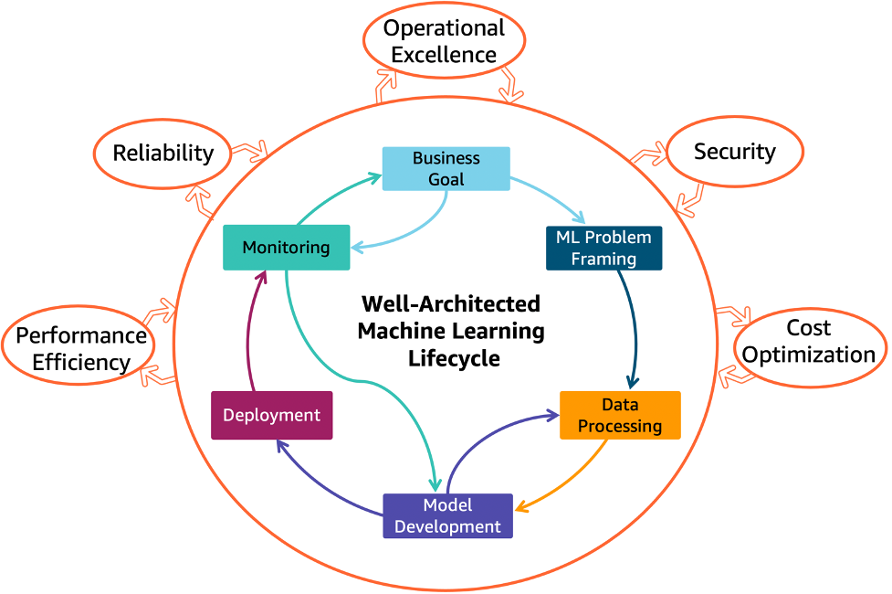

# The ML Workflow

## Learning goals

TODO: add learning goals

# Intro

## Remember the ML lifecycle?

## End-to-end ML Workflow

## It's complex

- Data versioning
- Labelling data
- Using notebooks
- Automating training
- Automating evaluation
- Storing models
- Serving models (i.e. deployment)
- Monitoring and logging

## We focus on

TODO: aanvullen als er nog extra dingen bij komen

- Using notebooks
- Automating training
- Serving models (i.e. deployment)
- Monitoring and logging

# ML pipelines

## What is a pipeline?

- A sequence of steps
- Executed in a specific order
- Each step
  - has a specific purpose
  - has specific inputs and outputs
  - can be executed in isolation

## ML pipelines

- [Kubeflow](https://www.kubeflow.org/)
- [TFX](https://www.tensorflow.org/tfx/)
- [AWS SageMaker](https://aws.amazon.com/sagemaker/)
- [Azure Machine Learning](https://azure.microsoft.com/en-us/products/machine-learning)
- [Google Vertex AI](https://cloud.google.com/vertex-ai)

## Kubeflow

<https://www.kubeflow.org/>

- Open source
- Runs on Kubernetes (likely managed)
- Make ML workflows portable and scalable
- Supports Jupyter notebooks, TensorFlow, PyTorch, etc.

## Kubeflow overview

## TFX

<https://www.tensorflow.org/tfx/>

- End-to-end platform for deploying production ML pipelines
- Manages the entire ML workflow
- Create pipelines via Python API
- Tends to be complex and buggy
- Runs on-premise or in the cloud

## TFX components

## Cloud ML services

- AWS SageMaker, Azure Machine Learning, Google Vertex AI
- Fully managed service
- Build, train, and deploy ML models
- Supports Jupyter notebooks, TensorFlow, PyTorch, etc.
- Vendor lock-in

# Get started with the lab assignment!

## Setup

TODO: aanvullen

## Kubeflow lab assignment

TODO: aanvullen
