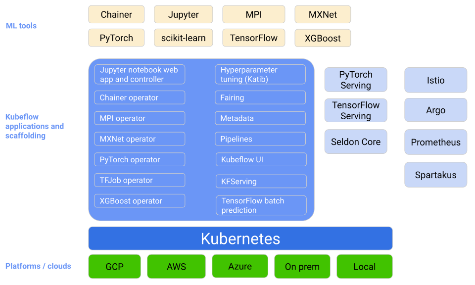

# The ML Workflow

## Learning goals

TODO: add learning goals

# Intro

## Introduction

- Development &ne; production
  - Dev: scikit-learn, Jupyter...
  - Prod: NodeJS, TFX, Kubeflow...
- Ideally: same code, different configuration
  - Sometimes same vendor, same cloud, same tools
  - Sometimes not possible

---

> Think about your tools even before you start coding!
> A good toolset can save you a lot of time and effort.

## Remember the ML lifecycle?

## End-to-end ML Workflow

## It's complex

- Data versioning
- Labelling data
- Using notebooks
- Automating training
- Automating evaluation
- Storing models
- Serving models (i.e. deployment)
- Monitoring and logging

## We focus on

TODO: aanvullen als er nog extra dingen bij komen

- Using notebooks
- Automating training
- Serving models (i.e. deployment)
- Monitoring and logging

## Considerations (1/3)

- Tooling
  - impact on model
  - effort to put in in prod
  - output format of ML model (PMML, ONNX...)
  - ...
- Performance
  - Python vs C++
  - must run on a low end device vs high end server

## Considerations (2/3)

- Data access
  - bundled with model (= frozen data)
  - database, cloud storage... (= dynamic data)
  - prod env should have access, correct drivers...

## Considerations (3/3)

- Training vs inference
  - training: most expensive step in ML lifecycle
  - inference: most of time spent here in prod
  - think about how to optimize both
  - do not over engineer the model

::: notes

<b><u>Example for data access</u></b>

A model evaluating apartment prices may use the average market price in a zip code area.
However, the user or the system requesting the scoring will probably not provide this
average and would most likely provide simply the zip code, meaning a lookup is necessary
to fetch the value of the average.

:::

# Model risk evaluation

## Model evaluation

- Model mimics reality, but is imperfect
- Malfunctions or malicious attacks can cause harm

## Questions to ask before deploy

- What if the model acts in the worst imaginable way?
- What if a user manages to extract the training data or the internal logic of the model?
- What are the financial, business, legal, safety, and reputational risks?

## Causes for trouble

- Bugs (your code, runtime framework...)
- Low quality training data
- High difference prod vs training data
- Misuse of model
- Adversarial attacks
- Bias, unethical use
- ...

::: notes

Adversarial attacks:

- malicious attacks on the data which may seem okay to a human eye but causes misclassification
  in a machine learning pipeline. These attacks are often made in the form of specially designed
  "noise", which can elicit misclassification.
- See <https://www.analyticsvidhya.com/blog/2022/09/machine-learning-adversarial-attacks-and-defense>

:::

## Quality assurance

- Does not only occur at the end of the pipeline
- Occurs at every step of the pipeline
- Can be automated with e.g. [Kubeflow](https://www.kubeflow.org/), [TFX](https://www.tensorflow.org/tfx/) (= pipelines)

# ML pipelines

## What is a pipeline?

- A sequence of steps
- Executed in a specific order
- Each step
  - has a specific purpose
  - has specific inputs and outputs
  - can be executed in isolation

## ML pipelines

- [Kubeflow](https://www.kubeflow.org/)
- [TFX](https://www.tensorflow.org/tfx/)
- [AWS SageMaker](https://aws.amazon.com/sagemaker/)
- [Azure Machine Learning](https://azure.microsoft.com/en-us/products/machine-learning)
- [Google Vertex AI](https://cloud.google.com/vertex-ai)

## Kubeflow

<https://www.kubeflow.org/>

- Open source
- Runs on Kubernetes (likely managed)
- Make ML workflows portable and scalable
- Supports Jupyter notebooks, TensorFlow, PyTorch, etc.

## Kubeflow overview

## TFX

<https://www.tensorflow.org/tfx/>

- End-to-end platform for deploying production ML pipelines
- Manages the entire ML workflow
- Create pipelines via Python API
- Tends to be complex and buggy
- Runs on-premise or in the cloud

## TFX components

## Cloud ML services

- AWS SageMaker, Azure Machine Learning, Google Vertex AI
- Fully managed service
- Build, train, and deploy ML models
- Supports Jupyter notebooks, TensorFlow, PyTorch, etc.
- Vendor lock-in

# Get started with the lab assignment!

## Setup

TODO: aanvullen

## Kubeflow lab assignment

TODO: aanvullen
