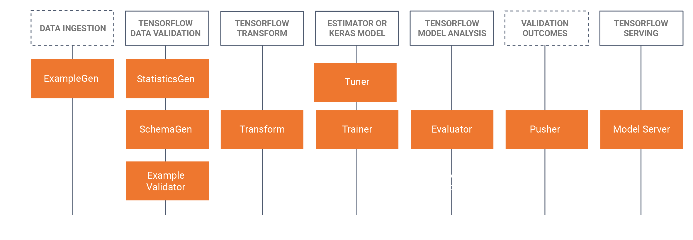

# TensorFlow Extended

## Learning goals

- Understanding the concept of ML pipelines
- Understanding the components of TensorFlow Extended
- Understanding the basic architecture of ML metadata stores
- Being able to create an ML pipeline
- Being able to manipulate TFX components
  - ExampleGen, SchemaGen, StatisticsGen, ExampleValidator
  - Transform, Trainer, Evaluator, Pusher
- Being able to interpret the outputs of an ML pipeline

# Intro

## Introduction

- Development &ne; production
  - Dev: scikit-learn, Jupyter...
  - Prod: NodeJS, TFX, Kubeflow...
- Ideally: same code, different configuration
  - Sometimes same vendor, same cloud, same tools
  - Sometimes not possible

---

> Think about your tools even before you start coding!
> A good toolset can save you a lot of time and effort.

## Considerations (1/3)

- Tooling
  - impact on model
  - effort to put in in prod
  - output format of ML model (PMML, ONNX...)
  - ...
- Performance
  - Python vs C++
  - must run on a low end device vs high end server

## Considerations (2/3)

- Data access
  - bundled with model (= frozen data)
  - database, cloud storage... (= dynamic data)
  - prod env should have access, correct drivers...

## Considerations (3/3)

- Training vs inference
  - training: most expensive step in ML lifecycle
  - inference: most of time spent here in prod
  - think about how to optimize both
  - do not over engineer the model

::: notes

<b><u>Example for data access</u></b>

A model evaluating apartment prices may use the average market price in a zip code area.
However, the user or the system requesting the scoring will probably not provide this
average and would most likely provide simply the zip code, meaning a lookup is necessary
to fetch the value of the average.

:::

# Model risk evaluation

## Model evaluation

- Model mimics reality, but is imperfect
- Malfunctions or malicious attacks can cause harm

## Questions to ask before deploy

- What if the model acts in the worst imaginable way?
- What if a user manages to extract the training data or the internal logic of the model?
- What are the financial, business, legal, safety, and reputational risks?

## Causes for trouble

- Bugs (your code, runtime framework...)
- Low quality training data
- High difference prod vs training data
- Misuse of model
- Adversarial attacks
- Bias, unethical use
- ...

::: notes

Adversarial attacks:

- malicious attacks on the data which may seem okay to a human eye but causes misclassification
  in a machine learning pipeline. These attacks are often made in the form of specially designed
  "noise", which can elicit misclassification.
- See <https://www.analyticsvidhya.com/blog/2022/09/machine-learning-adversarial-attacks-and-defense>

:::

## Quality assurance

- Does not only occur at the end of the pipeline
- Occurs at every step of the pipeline
- Can be automated with e.g. [TensorFlow Extended](https://www.tensorflow.org/tfx) (= pipelines)

# TensorFlow Extended

## TensorFlow Extended (TFX)

- End-to-end platform for deploying production ML pipelines
- Manages the entire ML workflow
- Create pipelines via Python API
- <https://www.tensorflow.org/tfx>

## TensorFlow Extended (TFX)

- Either on-premise or in the cloud
  - Local orchestrator
  - Vertex AI Pipelines (Google Cloud)
  - Amazon SageMaker (AWS)
  - Azure Machine Learning
  - Apache Airflow (open source)
  - Kubeflow Pipelines (open source)

## TFX components

## Flow between components

## ExampleGen

- Ingests data from various data sources
  - csv, `TFRecord`, BigQuery...
- Shuffles dataset
- Generates examples
- Consistent and configurable partitioning
- Emits: `tf.Example` records, proto format...

## StatisticsGen

- Computes statistics over data
  - both training and serving data
- Uses [Apache Beam](https://beam.apache.org) to scale to large datasets

## SchemaGen

- Uses statistics to generate a schema
- Schema = description of the data
  - instance of [schema.proto](https://github.com/tensorflow/metadata/blob/master/tensorflow_metadata/proto/v0/schema.proto)
- Infers types, ranges, categories...

> Always heck if the generated schema makes sense and change if necessary!

## ExampleValidator

- Identifies anomalies in the data
  - both training and serving data
- Can detect:
  - divergence from schema
  - training skew
  - data drift
  - custom validation logic (SQL-based config)

## Transform

- Feature engineering
- Data preprocessing
- Emits: `SavedModel` for Trainer & pre-/post-transform statistics

## Trainer

- Trains the model
- Requires
  - a file with the model code
  - protobuf definition of the train and eval args
- Optionally
  - a schema
  - a transform graph (from Transform)
  - pre-trained models
  - hyperparameters (from Tuner)

## Evaluator

- Evaluates the model
- Ensures the model is "good enough" to deploy
- Requires a baseline
  - first time: no baseline
- Allows to configure metrics, slices...
- Emits: ML metadata with results

## Pusher

- Push a validated model to a deployment target
- Relies on blessings from validation components
  - Not blessed? No push!
- Consumes: `SavedModel` format
- Emits: same `SavedModel` format with versioning metadata

## And more...

- Tuner
- InfraValidator
- BulkInferrer
- Custom components

## References

- TensorFlow Extended Guide: <https://www.tensorflow.org/tfx/guide>

# Versioning

## Data versioning

- Versioning is important!
- Keep track of
  - training data
  - model code
  - hyperparameters
  - model weights
  - ...

## Data versioning tools

::: {.twocolumns}
:::: {.col}

- [ML metadata (TFX)](https://www.tensorflow.org/tfx/guide/mlmd)
- [Neptune](https://docs.neptune.ai/tutorials/data_versioning/)
- [Pachyderm](https://www.pachyderm.com/)
- [Delta Lake](https://delta.io/)

::::
:::: {.col}

- [Git LFS](https://git-lfs.com/)
- [Dolt](https://github.com/dolthub/dolt)
- [lakeFS](https://lakefs.io/blog/data-versioning/)
- [DVC](https://dvc.org/)

::::
:::

## ML metadata

- Helps to track and manage ML artifacts
  - dataset, hyperparameters used
  - pipeline, model version
  - ...

## Metadata store

- Stores metadata
  - about ML artifacts
  - about executions of pipeline steps
  - about the pipeline itself (e.g. lineage information)
- e.g. models, datasets, training runs...
- See: <https://www.tensorflow.org/tfx/guide/mlmd>

## Metadata store

::: notes

- `ArtifactType`: defines the type of an artifact
  - e.g. `Model`, `Schema`, `HyperParameters`
- `Artifact`: instance of an `ArtifactType`
- `ExecutionType`: component or step in a workflow
  - e.g. `Trainer`, `Evaluator`
- `Execution`: instance of an `ExecutionType`, recorded when pipeline/step is run
- `Event`: records the relationship between an `Artifact` and an `Execution`
  - = input and output
- `ContextType`: conceptual group of artifacts and executions
  - e.g. project, pipeline runs...
- `Context`: instance of a `ContextType`
- `Attribution`: records the relationship between an `Artifact` and a `Context`
- `Association`: records the relationship between an `Execution` and a `Context`

:::

# Get started with the lab assignment!

## Setup

- No local setup required
- Follow tutorials from TFX docs

## TFX lab assignment

Follow the steps in the assignment <https://github.com/HOGENT-MLOps/mlops-labs/blob/main/assignment/04-tfx.md>

Download every notebook when you're done and commit them to your repository in a directory named `tflab`.

Also keep a cheat sheet of important code snippets!
