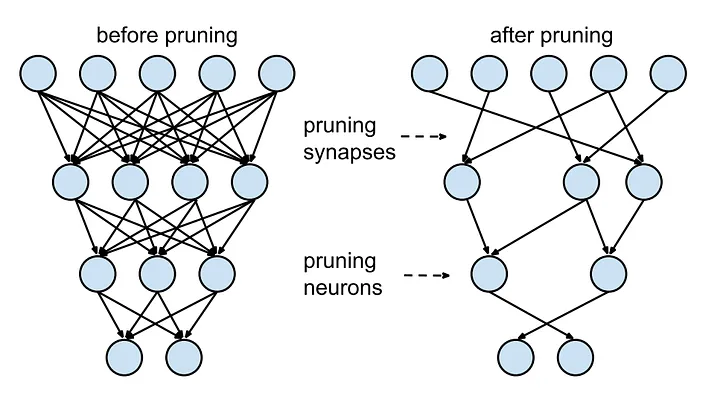
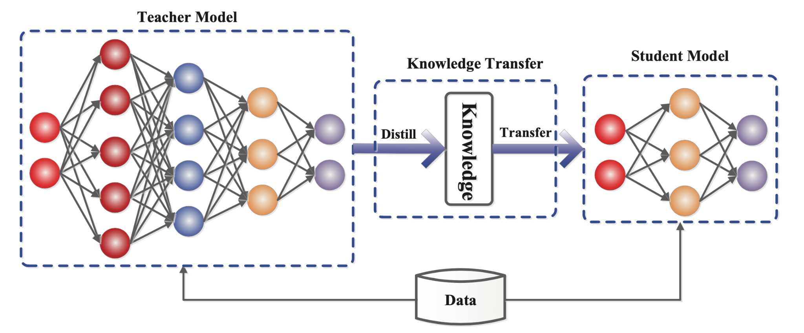

# Edge deployments

## Learning goals

- Get familiar with the TensorFlow Lite framework
- Convert a TensorFlow model to a TensorFlow Lite model with quantization
- Train a quantize aware model
- Perform weight pruning on a model

# Running models on edge devices

## What is edge computing?

- Bring computers close to
  - end user
  - data source
- Process data locally, instead of sending it to the cloud

## Why edge computing?

- Faster and more reliable
- Lower latency
- No connection to the Internet needed
- Privacy
- ...

## Edge computing in ML

- Run ML models on edge devices, e.g.
  - smartphones
  - Raspberry Pi
  - NVIDIA Jetson
  - ...

## Challenges

- Everything is limited:
  - resources
  - power
  - storage
  - bandwidth
  - ...

**Think about model size and resource needs.**

## References

- Red Hat. (2022, October 22). [What is edge machine learning?](https://www.redhat.com/en/topics/edge-computing/what-is-edge-machine-learning)

# Model compression

## Model compression

Some techniques:

- Dimensionality reduction
- Quantization
- Pruning
- Knowledge distillation

## Dimensionality reduction

- Reduce the number of features
- Examples:
  - Principal Component Analysis (PCA)
  - Singular Value Decomposition (SVD)
  - Linear Discriminant Analysis (LDA)
  - ...

## Quantization

- Reduce the number of bits used to represent a number
- i.e. represent weights and activations with fewer bits
  - e.g. 8-bit int instead of 32-bit float
- Can be done during training or after training

## Pruning

- Remove irrelevant weights
- i.e. remove weights that are close to zero
- Usually done after training
- Followed by retraining to reduce accuracy loss
- Can also be done during training

## Pruning

## Knowledge distillation

- Train a smaller model to mimic the behaviour of a larger model
- Student model learns from teacher model

## Knowledge distillation

## References

- Barla, N. (2023, August 8). [Dimensionality Reduction for Machine Learning](https://neptune.ai/blog/dimensionality-reduction)
- Hugging Face. [Quantization](https://huggingface.co/docs/optimum/concept_guides/quantization)
- Souvik, P. (2020, June 9). [Pruning in Deep Learning Models](https://medium.com/@souvik.paul01/pruning-in-deep-learning-models-1067a19acd89)
- Teki, S. (2023, September 23). [Knowledge Distillation: Principles, Algorithms, Applications](https://neptune.ai/blog/knowledge-distillation)

# TensorFlow Lite

## What is TensorFlow Lite?

- Framework for deploying ML models on mobile and IoT devices
- Optimized for on-device inference
- Supports Android, iOS, Linux and microcontrollers

<https://www.tensorflow.org/lite/guide>

## TensorFlow Lite models

- Different from TensorFlow models
- Optimized for on-device inference
- Smaller and faster
- Can be converted from TensorFlow models

## TensorFlow model optimization toolkit

- Collection of tools for optimizing TensorFlow models
  - Separate from TensorFlow Lite
- Includes tools for:
  - Quantization
  - Pruning
  - ...

<https://www.tensorflow.org/model_optimization/guide>

# Get started with the lab assignment!

## Quantization and pruning

- Use Google Colab to run `ml-workflow/quantization-and-pruning.ipynb`
- Convert a TF model into a TF Lite model with quantization
- Train a quantize aware model
- Perform weight pruning on a model
