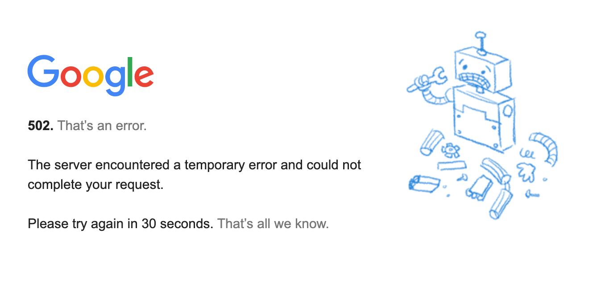
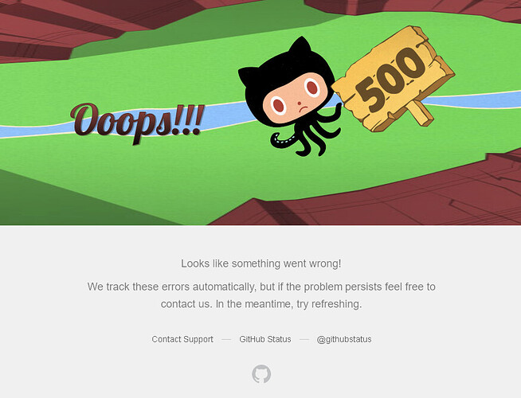
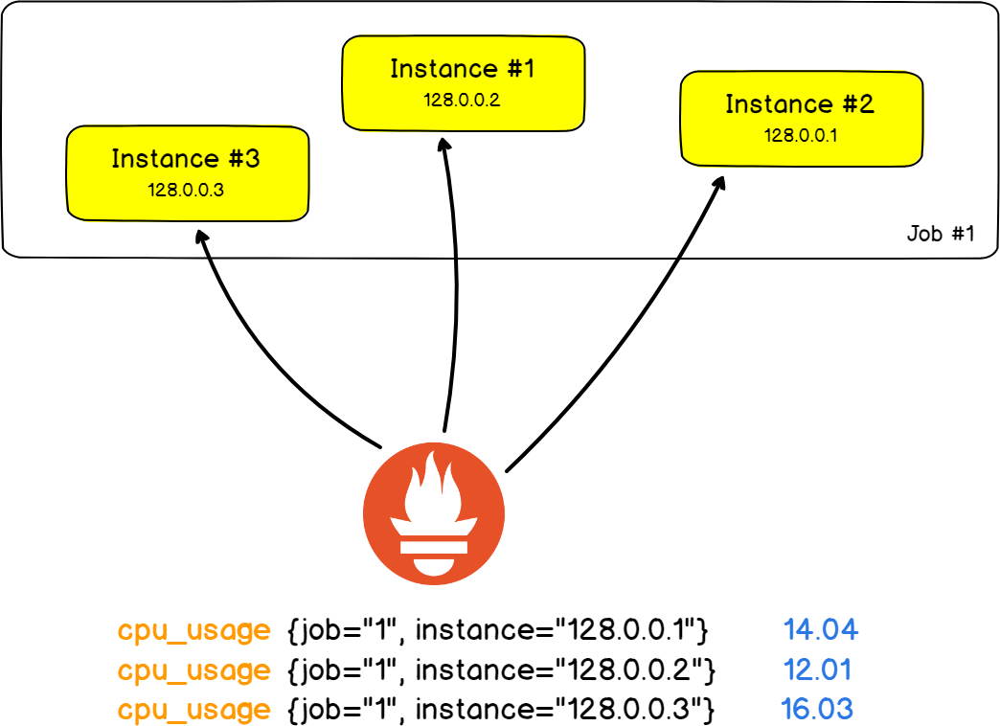
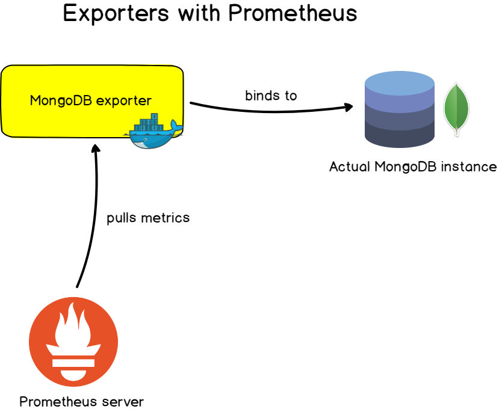
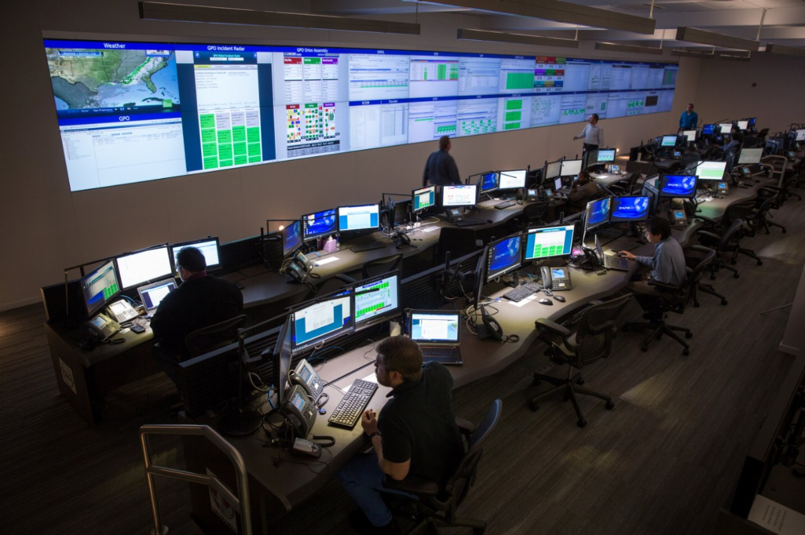
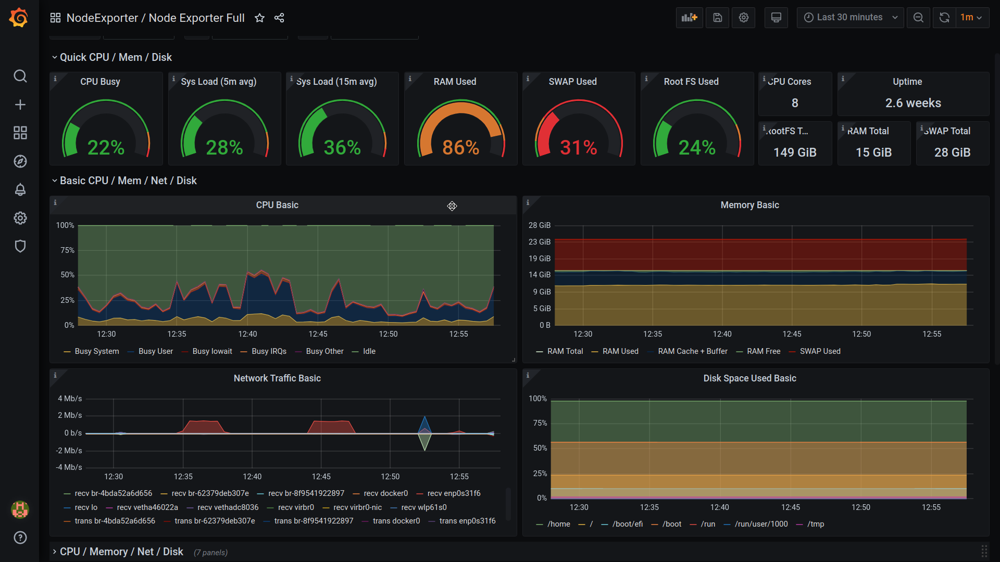
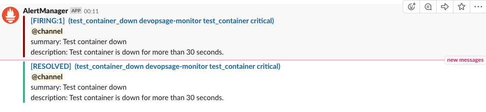
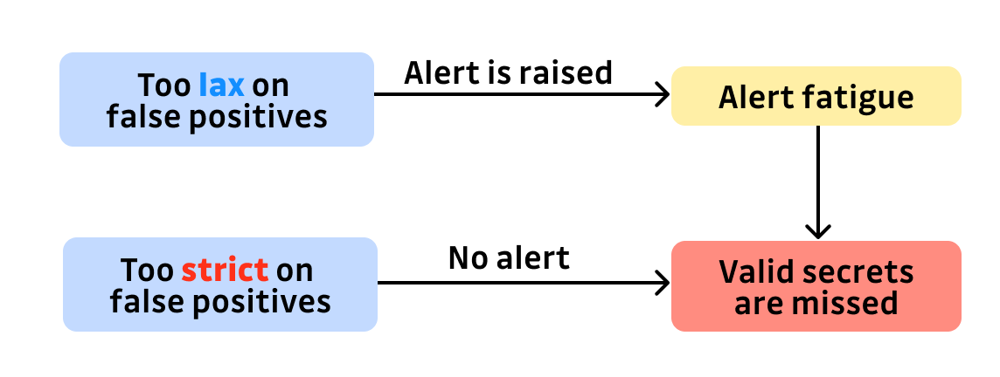
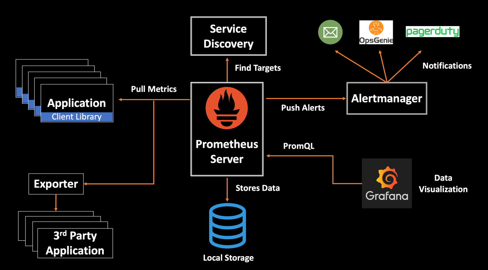

# Monitoring

---

## Learning goals

- Understanding the concept of monitoring
- Understanding the concept of alerting
- Understanding how Prometheus, Grafana, AlertManager, a receiver, and Node Exporter work together

---

- Being able to set up monitoring using Prometheus
  - Monitoring of an application or the result of an ML pipeline
  - Monitoring of a VM or host
- Being able to set up visualization dashboards using Grafana
- Being able to set up alerting using Alert Manager and a receiver such as Discord

---

# Intro

---

## Why?

Do you know if ...

- ... a new version of an AI model has regressed?
- ... a new model uses too much resources?
- ... a VM/container is down?
- ... a VM/container/application uses too much resources?
- ... the network is saturated?
- ... the temperature of hardware components is too high?
- ... ?

---

---

---

## Knowing is everything

> "Assumption is the mother of all screw ups"
> ~ Eugene Lewis Fordsworthe

> "To measure is to know"
> ~ Lord Kelvin (rephrased)

---

## Knowing is everything

- Monitoring reduces downtime
  - If you don't monitor, how do you even know if/when it goes down?
- Sometimes allows to predict errors in advance
  - e.g. disk space is filling up
- Metrics tell a story
  - If you know the error, you can fix it
  - Monitoring gathers the clues for you

---

## Metrics logging

- Gather metrics
- Often numbers, percentages, ...
  - Things you can measure
  - e.g. CPU load, RAM usage, bandwidth consumption, disk storage, ...
- Often stored in a time series database

---

---

## Tools

There are a lot of metric monitoring tools available:

- Prometheus
- Nagios
- Zabbix
- Sensu
- Datadog
- ...

<https://github.com/awesome-foss/awesome-sysadmin#monitoring>

---

## Prometheus

---

### Prometheus overview

<https://prometheus.io/>

- Open source
- Originally from SoundCloud
- Now part of Cloud Native Computing Foundation
  - Home of Kubernetes
- Collects and stores metrics as time series data
  - time stamp
  - key-value pairs called labels

---

<https://devconnected.com/the-definitive-guide-to-prometheus-in-2019/>

---

### Features

- Time series collections via pull model over HTTP
- PromQL query language
- Service discovery or static configuration
- No reliance on distributed storage

---

### Components

- Prometheus server:
  - scrapes, stores TS data
- [Client libraries](https://prometheus.io/docs/instrumenting/clientlibs/):
  - for instrumenting application code
- [Exporters](https://prometheus.io/docs/instrumenting/exporters/)
  - for exposing metrics so Prometheus can scrape them
  - e.g.
    - Node exporter for basic system metrics
    - Mysqld exporter for MySQL
    - Kubernetes
    - SNMP
    - ...

---

---

---

# Visualization

---

## Dashboard

Most datacenters have a dashboard to visualize metrics.

---

## Tools

Often builtin, but external tools are available:

- Grafana
- Kibana
- ...

---

## Grafana

<https://grafana.com/>

- Open source
- Originally from Orbitz
- Visualizes time series data
- Allows for basic alerting
- Has a [public repository](https://grafana.com/grafana/dashboards/) for dashboards
  - You can export and import existing databases to this library

---

---

## Tips

Make sure that ...

- ... the refresh interval on the dashboards is acceptable
  - Don't forget that the interval on the metrics server / monitoring tool must also match
- ... the dashboard doesn't burn into the screen
  - Set it up to cycle

---

# Alerting

- A dashboard is a passive way to let you now if things go wrong.
  - You can't constantly keep looking at the dashboard
- How about you get notified is something suspicious happens?

---

## Alert rules

When do you want to trigger an alert?

- E.g.
  - CPU is above 90% for 10 minutes
  - Disk is reading more than 50 MB/s for 5 minutes
  - Physical hardware component is too hot (> 95 C)
  - A container has disappeared
  - More than 80% of MySQL connections are in use for 2 minutes
  - ...

---

## Receivers

To where should we send the alerts?

- E.g.
  - E-mail
  - Teams
  - Slack
  - Matrix.org
  - Discord
- Often done by webhooks

---

## Resolving

- How do you know when the problem is fixed?
  - Again, it is not handy to constantly look at the metrics or dashboards
- Solution: alert again when a previous alert is no longer valid.
  - E.g. the CPU load has dropped to 10 %, send a notification that the CPU is no longer at 100%

---

## Alerting fatigue

---

---

- The most work of setting up monitoring and alerting is adjusting the rules
- Looking for a nice balance between false positives and false negatives
  - Balance is unique for each case/situation
  - Too much false positives: alerting fatigue
  - Too much false negatives: you have no clue that something is happening

---

## Tools

- Manual (scripts)
- Built in (e.g. Grafana)
- AlertManager
- ...

---

## AlertManager

- Also developed by the Prometheus project
- Has 3 core concepts:
  - Grouping: combining alerts of similar nature into a single notification
  - Inhibition: suppressing notifications for certain alerts if certain other alerts are already firing
  - Silences: mute alerts for a given time
- A great collection of community vetted rules can be found at https://samber.github.io/awesome-prometheus-alerts/rules.html
- Has default support for various receivers (e.g. email, Discord, Teams, Slack, ...)

---

# Prometheus + Grafana + AlertManager

---

# Get started with the lab assignment!

---

## Monitoring a mocked model

- Create a mock model that provides out metrics
- Set up Prometheus
- Set up Grafana
  - Create a dashboard
- Set up Alertmanager
  - Create alerting rules
- Set up Discord
  - Receive alerts from Discord

---

## Monitoring a VM

- Create a VM
- Set up Node Exporter on the VM
- Import a dashboard for Node Exporter in Grafana
- Create an alert for CPU load
- Stresstest the VM to test the alert
  - Receive alerts when the rules are triggered
  - Receive a resolve alert when the CPU usage is back to normal

---
