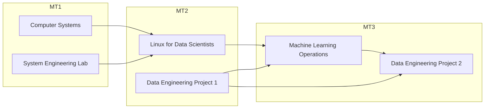

# Study Guide

## Course within the curriculum

This course provides an introduction to the field of Machine Learning Operations (MLOps), which encompasses deploying, maintaining, and monitoring machine learning models in production environments.

It is commonly assumed that the ML code constitutes the largest component of an ML project, but this is far from the truth. The code represents only a small fraction of the entire project. Other critical components include data collection, model analysis, configuration, automation, serving infrastructure, metadata management, monitoring, and more. This reality is effectively illustrated in the paper by [Sculley et al. (2015)](https://proceedings.neurips.cc/paper_files/paper/2015/file/86df7dcfd896fcaf2674f757a2463eba-Paper.pdf).

When working as an AI & Data Engineer, it is essential to have knowledge of best practices in Machine Learning Operations. Due to the breadth of this subject area, this course focuses on the most important topics and tools while leaving room in each lab for independent experimentation and exploration.

This course was developed through intensive collaboration with [Captic](https://www.captic.com), resulting in content that is well-tailored to industry needs and labs based on real-world use cases.

Within the curriculum, this course is situated in the AI & Data Engineer track of the 3rd year (MT3). In terms of content, it continues on the Linux for Data Scientists and Data Engineering Project I courses from the 2nd year (MT2).

## Learning goals and competences

The knowledge and skills you acquire in Machine Learning Operations can also be applied in the course Data Engineering Project II.

Upon successful completion of this course, you will be able to:

-   Describe **CI/CD principles** in the context of ML.
-   Deploy an ML model into **production** and **monitor** it using CI/CD principles.
-   Describe the challenges and possible solutions for running ML models on devices with limited computing power.
-   Deploy and run ML models on devices with **limited computing power**, e.g., using TensorFlow Lite.
-   Use virtualization and containerization techniques to **deploy** ML models.

## Required prior knowledge

We expect average proficiency in the following areas:

-   **Linux:**
    -   Software installation
    -   Basic commands
    -   Bash scripting
-   **Docker:**
    -   Building container images
    -   Managing containers, volumes, and port bindings
-   **Git and GitHub**

## Course contents

<!-- TODO: update the course contents -->

-   **Introduction:** Setting up the working environment
-   **Module 1: Docker**
    -   Building and publishing container images for ML model hosting
    -   Managing multiple containers using Docker Compose
    -   Deploying models through Triton containers
    -   Working with public model repositories (NGC, Hugging Face...)
-   **Module 2: ML Workflow**
    -   Introduction to ML project workflows
    -   Setting up ML pipelines in Prefect
    -   Guest lecture by Captic (recording provided for TIAO students)
-   **Module 3: Quantization and Pruning**
    -   Introduction to challenges and techniques for ML models on edge devices
    -   Training TensorFlow Lite models using quantization and pruning techniques
-   **Module 4: Hyperparameter Tuning**
    -   Introduction to hyperparameter optimization
-   **Module 5: Monitoring and Logging**
    -   Monitoring ML pipelines, models in production, and build VMs
    -   Collecting logs from ML pipelines and production models

:bulb: Comments and feedback on the course content can be given in class, via email or through an issue/PR on the GitHub repository.

## Learning materials

### Theoretical learning materials

The theoretical content is curated from materials found across the web, including resources from [YouTube](https://www.youtube.com/), [LinkedIn Learning](https://www.linkedin.com/learning/), and videos on [Panopto](https://hogent.cloud.panopto.eu/).

We provide a carefully curated list of resources for each module. These resources provide foundational knowledge in the domain of Machine Learning Operations and serve as theoretical support for tackling the lab assignments. You will be questioned on this theoretical material during the demonstrations of individual lab assignments. As a study method, you should build summary notes after each self-study session. Ask yourself questions and transition from a traditional student mindset to that of a lifelong learner.

### Lab assignments

During class hours, you will work on lab assignments. These are practical exercises that allow you to apply the theoretical knowledge you have acquired. The lab assignments are based on real use cases and provide a solid foundation for your future career.

Most lab assignments are performed in a local environment on your personal computer. It is important to understand that the concepts and tools you learn are transferable to other platforms and cloud services (such as AWS, Azure, or Google Cloud). You are encouraged to explore how these principles apply in different environments and to experiment with translating your solutions to other cloud providers as part of your learning process.

Your lecturer is available to help you with the lab assignments. If you encounter difficulties, search the internet first. If you still cannot find a solution, do not hesitate to ask for help. The lecturer can provide guidance or direct you to suitable additional study materials.

:bulb: Although the course content is written in English, all guidance and support is provided in Dutch.

## Teaching methods

-   Flipped classroom
-   Lab assignments
-   Guest lecture

In this course, you will work primarily on lab assignments. The supporting study materials should enable you to complete them successfully.

### Flipped classroom

This course employs a flipped classroom approach: theory is explained through videos and materials from external sources. Students must review these materials before attending lectures. Approximately 90 minutes of self-study materials per week are required. This approach allows us to work hands-on with the concepts you have learned during class hours.

**Important:** If you come unprepared, your presence in class will be largely unproductive, and working on labs will be of little benefit to you. Contact moments during class hours can be used to ask questions about the materials you have studied if anything is unclear. Conversely, instructors may also ask you questions about the material!

### Contact moments

#### Gent, Aalst & virtual campus

During regular contact moments, students work independently on lab assignments. Students can request explanations for specific problems or demonstrate their results in class or through a Panopto video. Be aware of the deadlines (see further below).

#### TIAO

TIAO students process the material at their own pace using the provided study materials and complete the lab assignments. They can schedule appointments with the lecturer during TIAO contact moments for individual progress discussions and follow-up.

There are no fixed deadlines for TIAO students, but it is strongly recommended to complete assignments as early as possible.

## Working and learning instructions

Working with lab assignments requires a degree of independence from you as a student, which is precisely the attitude expected of an IT professional. You must take the initiative to acquire the necessary knowledge and seek solutions to the problems you will undoubtedly encounter.

Help each other in this process: collaboration and knowledge sharing are encouraged. The lecturer is available to assist you if you encounter difficulties and can provide guidance or direct you to suitable additional study materials. Be sure to seek help if you get stuck so the lecturer can help you get back on track!

## Demo instructions

Throughout the semester, you are required to demonstrate your lab assignments. These demos are a key component of the learning process, providing you with the opportunity to present your work, confirm your understanding, and receive valuable feedback. To help you make the most of this opportunity, please prepare carefully and follow the guidelines below:

-   You can only demo a lab assignment once.
-   You must present your work within 3 weeks after the announced start date for the assignment (see [semester schedule](#semester-schedule)); otherwise, the lab will be marked as "absent".
    -   Deadlines are intentionally strict to encourage you to present lab assignments throughout the semester rather than postponing everything until the end.
    -   **Note for TIAO:** While there is no fixed deadline for demos, it is strongly recommended to complete them as early as possible.
-   You are limited to performing one demo per week.
-   Demos may not exceed 15 minutes.
-   You can demo a lab during contact times or by submitting a Panopto video.

**Requirements for Panopto submission of a lab:**

-   Use the acceptance criteria to guide the demo.
-   Demonstrate the use of software; don't just review your lab report. We want to see the lab in action!
-   We cannot ask additional questions as we would during an in-person demo. What we don't see or hear, we cannot take into account. Be thorough!
-   Submit the link within the given timeframe.

## Tutoring

If you have questions about the course content or are unsure about or stuck on an exercise, ask for help!

-   Regular and virtual campus students should speak to their supervising lecturer during contact times.
-   TIAO students can schedule appointments. Depending on the lecturer's availability, this may take place on campus or through Teams.
-   Contact lecturers personally (via email) only if you have a personal question that is confidential or not relevant to other students.
    -   Do not use Teams; email only.
-   Under no circumstances should you call the lecturers via Teams for a voice or video call. If necessary, your lecturer will schedule a Teams call with you at a pre-arranged time.
-   Keep in mind that lecturers cannot answer questions on a daily basis! Even during vacation or recess, you may not expect an immediate answer.

**Contact information lecturers:**

-   Simon De Gheselle (titular): simon.degheselle@hogent.be
-   Thomas Aelbrecht: thomas.aelbrecht@hogent.be
-   Martijn Saelens: martijn.saelens@hogent.be

:bulb: It always gives a poor impression when you don't seem to know which lecturer you are assigned to...

## Semester schedule

The following schedule provides suggested start dates for each module. Actual dates may shift due to holidays, unforeseen events, or changes in the academic calendar. Please use this as a guideline and stay updated on any announcements regarding schedule adjustments.

<!-- TODO: update the schedule when the new labs are ready -->

1. **Introduction:** Software installation / **Lab 1:** Docker
2. (continued)
3. **Lab 2:** The ML Workflow (guest lecture)
4. (continued)
5. (continued)
6. **Lab 3:** Quantization and pruning
7. (continued)
8. **Lab 4:** Hyperparameter tuning
9. (continued)
10. **Lab 5:** Monitoring and alerting
11. (continued)
12. (continued)
13. **Optional:** Catch-up session

## Assessment

The evaluation of this course is conducted entirely through continuous assessment. Specifically, you will be evaluated based on your performance on the assigned lab assignments.

You are evaluated based on a portfolio that you compile during the semester and defend throughout the semester and optionally during an evaluation moment in the exam period. Specifically, that portfolio consists of the following elements:

-   Source code maintained by each student in an assigned GitHub repository
-   Detailed lab reports, also maintained in an assigned GitHub repository
-   Demonstration of partial results to the lecturer during the semester
-   Demonstration of final results to the lecturer during the exam period
-   Grade assignment is based on "rubrics" described in the evaluation card published on Chamilo

A table lists a number of criteria that you must meet. You can "meet" these at different levels: "proficient", "advanced", "expert", or at worst "not yet proficient". The evaluation chart describes exactly what you need to do to achieve each level.

To pass this course, you must successfully complete and pass each individual lab assignment. If you fail to meet the minimum requirements for any lab, you cannot pass the course, regardless of your performance on other labs. Non-technical criteria (such as reporting) also impact your final grade and may lower your score below the passing threshold (10/20) if not adequately addressed.

Note that you must deliver a working product (source code), submit the reports, and provide the required demos. If any deliverable is missing, the assignment will be considered incomplete and you will receive a score of 0 for that assignment.

If you have successfully demonstrated all lab assignments during the semester, no further action is required during the exam period. If any lab assignments remain undemonstrated, you must present these during the exam period. You will have a maximum of 20 minutes to demonstrate the outstanding lab assignments.

:warning: The exam period can only be used to demonstrate lab assignments for which the deadline has not yet passed. Labs for which the interim deadline has expired cannot be presented during the exam period and will be marked as "not yet proficient" according to HOGENT regulations. It is therefore essential to respect all interim deadlines throughout the semester to ensure eligibility for final demonstration during the exam period.

## Deadlines

Students must deliver and personally demonstrate partial deliverables to the lecturer within allotted timeframes during the semester. These timeframes are considered interim deadlines under [HOGENT regulations](https://www.hogent.be/student/een-vlotte-start/onderwijs-en-examenregeling/). Failure to deliver partial results on time is considered failure to meet interim deadlines and is sanctioned accordingly. A student will then receive the assessment "not yet proficient" for the lab assignments that were not delivered on time and consequently cannot pass.

-   **Regular students** regularly visit the lecturer during contact moments for individual follow-up and delivery of partial results. Even if you have accomplished little or nothing, you should attend. After all, this indicates that you are stuck somewhere, and the lecturer can then help you get back on track.

-   **Distance learning students** can provide partial results in several ways:
    -   By screencast via Panopto (forward link to lecturer)
    -   Via videoconferencing (Microsoft Teams, by appointment)
    -   During contact moments for TIAO students, if the lecturer is present (by appointment only)

## Resit

Students who do not pass the course will have a second examination opportunity (resit) to complete only the lab assignments for which competence was not demonstrated. You must complete and present these outstanding labs.

During the resit exam period, you will have up to 20 minutes to demonstrate a maximum of 2 lab assignments and answer questions from the lecturer. If you need to present more than 2 labs, you must submit Panopto videos for the additional labs before a given deadline in the resit exam period.

:warning: If you do not schedule an appointment to discuss the labs you need to resit by the end of the feedback period, you will be considered as not participating in the second exam opportunity.
