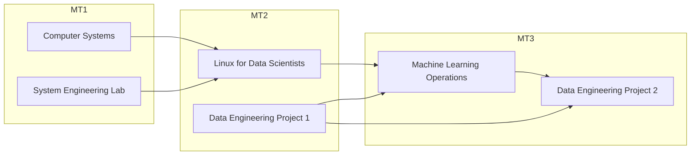

# Study Guide

## Course within the curriculum

This course provides an introduction to the field of Machine Learning Operations, i.e., deploying, maintaining and monitoring Machine Learning models in production.

It is often thought that the ML code is the largest part of an ML project, but nothing could be further from the truth. The code is only a small fraction of the entire project. Other components to consider include data collection, model analysis, configuration, automation, serving infrastructure, metadata management, monitoring, and more. This is nicely illustrated in the paper by [Sculley et al. (2015)](https://proceedings.neurips.cc/paper_files/paper/2015/file/86df7dcfd896fcaf2674f757a2463eba-Paper.pdf).

When working as an AI & Data Engineer, it is thus essential to have knowledge of the best practices in Machine Learning Operations. Of course, this subject area is too large to cover entirely. This course focuses on the most important topics and tools, leaving room in each lab for experiments on your own initiative.

This course came about thanks to an intense collaboration with [Captic](https://www.captic.com), resulting in content well tailored to the field and consisting of labs based on real use cases.

Within the curriculum, this course is situated in the AI & Data Engineer track of the 3rd year (MT3). In terms of content, it continues on the Linux for Data Scientists and Data Engineering Project I courses from the 2nd year (MT2).

## Learning goals and competences

The knowledge and skills you gain in Machine Learning Operations can also be applied in the course Data Engineering Project II.

After successful completion of this course:

-   You can describe **CI/CD principles** in the context of ML.
-   You can put an ML model into **production** and **monitor** it using CI/CD principles.
-   You can describe the challenges and possible solutions for running an ML model on devices with limited computing power.
-   You run an ML model on a device with **limited computing power**, e.g. using Tensorflow Lite.
-   You can use virtualization and containerization techniques to **deploy** an ML model.

## Required prior knowledge

We expect an average proficiency in:

-   Linux:
    -   Installation of software
    -   Basic commands
    -   Bash scripting
-   Docker
    -   Building container images
    -   Managing containers, volumes and port bindings
-   Git and GitHub

## Course contents

-   Introduction, setting up working environment.
-   Module 1: Docker
    -   Building and publishing a container image.
    -   Managing multiple containers using Docker Compose.
-   Module 2: continuous integration/delivery
    -   Setting up a CI/CD pipeline with GitHub Actions.
-   Module 3: The ML workflow
    -   Introduction to the flow of an ML project.
    -   Setting up an ML pipeline in Azure ML.
    -   Guest lecture by Captic, a recording will be provided for TIAO.
-   Module 4: Kubernetes
    -   Introduction to the basic building blocks of Kubernetes.
-   Module 5: Edge deployments
    -   Introduction to the challenges of and techniques for ML models on the edge.
    -   Training a TensorFlow Lite model.
-   Module 6: Hyperparameter tuning
    -   Introduction to hyperparameter tuning.
-   Module 7: Monitoring and logging
    -   Monitoring the ML pipeline, the model in production, the build VM...
    -   Collecting logs from the ML pipeline and the model in production.

:bulb: Comments and feedback on the course content can be given in class, via email or through an issue/PR on the GitHub repository.

## Learning mateirials

### Theoretical learning materials

The theoretical content is selected from material found all over the world wide web. This can include, but is not limited to material on [YouTube](https://www.youtube.com/), [LinkedIn Learning](https://www.linkedin.com/learning/), videos on [Panopto](https://hogent.cloud.panopto.eu/)...

We provide a well-curated list of resources per module. They provide a ground knowlegde of the domain of Machine Learning Operations. These topics should help as well in tackling the labs by having a theoretical foundation. Do not forget you will be questioned on this theoretical material during the demonstrations of the individual lab assignments. As a study method, you should build up your summary notes after each moment of self-study. Ask yourself enough questions and transition from a traditional student to a life-long-learner.

### Lab assignments

During class hours, you will work on lab assignments. These are practical exercises that allow you to apply the theoretical knowledge you have acquired. The lab assignments are based on real use cases and provide a solid basis to build on in your future career.

Your lecturer is available to help you with the lab assignments. If you get stuck, search on the Internet first. If you still can't find a solution, don't hesitate to ask for help. The lecturer can give you tips or refer you to suitable additional study materials.

:bulb: Although the course content is written in English, the lessons are given in Dutch.

## Teaching methods

-   Flipped classroom
-   Lab assignments
-   Guest lecture

In this course, you will work primarily on lab assignments. The supporting study materials should enable you to complete them successfully.

### Flipped classroom

This course will use a flipped-classroom approach: the theory is explained using videos and material from external sources. This shall be assessed by every student before coming to the lectures. About 90 minutes of self-lecture materials per week is what you are up for. This will allow us to work hands-on with the concepts that you have learned during class hours. Beware: if you are unprepared, your presence in class will be pretty useless and working on labs will be of no use to you. Contact moments during class hours of course can be used to ask questions on the materials that you have studied, if something would be unclear. Also, the other way round, tutors might ask some questions to you!

### Contact moments (Gent, Aalst & virtual campus)

During regular contact moments students work independently on lab assignments. Students can then request explanations for specific problems or can demonstrate the result in class or through a Panopto video.

### TIAO

TIAO students process the material at their own pace, using the study materials provided, and complete the lab assignments. They can make an appointment with the lecturer at the contact moments for TIAO students for an individual progress discussion and follow-up. TIAO students show interim results in a Panopto video.

## Working and learning instructions

Working with lab assignments requires a certain degree of independence from you as a student, but that is precisely also an attitude expected of a IT professional. Thus, you take the initiative yourself to acquire the necessary knowledge and look for solutions to the problems you will undoubtedly encounter.

Help each other in this: working together and sharing knowledge is encouraged. The lecturer is available to assist you if you get stuck and can give you tips or refer you to suitable additional study materials. Be sure to stop by if you get stuck somewhere so the lecturer can help you get back on track!

## Demo instructions

-   You can only demo a lab assignment once.
-   You must present a demo within 3 weeks after the theoretical session (see [schedule](#semester-schedule)), otherwise the lab will be marked als "absent".
    -   This short time frame is there to encourage you to present lab assignments during the semester instead of cramming everything in at the end.
-   You can demo a lab during contact times or by sending us a Panopto video.

Requirements for Panopto submission of a lab:

-   Use the acceptance criteria to guide the demo. We can't ask additional information as with a demo during contact times. What we don't see or hear, we can't take into account. Be thorough!
-   Demonstrate the use of software, don't just go over your lab report. We want to see the lab in action!
-   Send the link within the given time frame.

## Tutoring

If you have questions about the course content, or are unsure about/stuck on an exercise, ask for help!

-   Regular and virtual campus students are best to speak to their supervising lecturer during contact times.
-   TIAO students can make an appointment. Depending on the availability of the lecturer, this may take place on campus or through Teams.
-   Contacting the lecturers personally (via email) is only done if you have a personal question that is confidential or not relevant to other students.
    -   Do not use Teams, email only.
-   Under no circumstances is it ok to call the lecturers via Teams for a voice or video call. If necessary, the lecturers will schedule a Teams call with you at a pre-arranged time.
-   Keep in mind that the lecturers cannot answer questions on a daily basis! Even during a vacation or recess, you may not count on an answer.

Contact information lecturers:

-   Thomas Aelbrecht (titular): thomas.aelbrecht@hogent.be
-   Martijn Saelens: martijn.saelens@hogent.be

:bulb: It always gives a bad impression when you don't seem to know which lecturer you are assigned to...

## Semester schedule

Following weekly schedule is just an approximation! If classes are dropped, for example due to furloughs, shifts may occur.

1. Introduction, software install, M1. Docker
2. M2. CI/CD pipelines
3. (continued)
4. M3. The ML Workflow (guest lecture)
5. (continued)
6. M4. Kubernetes
7. (continued)
8. M5. Edge deployments
9. M6. Hyperparameter tuning
10. (continued)
11. M7. Monitoring and logging
12. (continued)
13. Optional: catch-up session

## Assessment

The evaluation of this course is done entirely through permanent evaluation. More specifically, you will be evaluated on the way you performed the given lab assignments.

You are evaluated on the basis of a portfolio that you put together during the semester and that you defend at an evaluation moment during the exam period. Specifically, that portfolio consists of the following elements:

-   The source code, maintained by each student in an assigned GitHub repository
-   Detailed lab reports, also maintained in an assigned GitHub repository
-   Demonstration of partial results to the lecturer during the semester
-   Demonstration of final results to the lecturer during the exam period
-   The assignment of the exam grade is based on "rubrics" described in the evaluation card published on Chamilo.

A table lists a number of criteria that you must meet. You can "meet" at different levels, specifically "proficient", "advanced", "expert", or at worst "not yet proficient". The evaluation chart describes exactly what you need to do to achieve each level.

To pass this course, you must demonstrate that you are at least "proficient" for all technical criteria. In other words, even if you are found "not yet proficient" for only one criterion, you cannot pass, no matter how well you have completed the other modules. The non-technical criteria (e.g. reporting) can still positively or negatively influence the exam grade depending on the level achieved (and possibly even cause you to drop below 10/20!).

Note that you must deliver both a working product (= source code) and submit the reports as well as the demos. If any of the deliverables are missing, the assignment will be considered unrealized.

## Deadlines

Students must deliver and personally demonstrate partial deliverables to the lecturer within allotted time frames during the semester. These time frames are considered interim deadlines under [HOGENT regulations](https://www.hogent.be/student/een-vlotte-start/onderwijs-en-examenregeling/). Failure to deliver partial results on time is thus considered failure to meet interim deadlines and is sanctioned as such. A student will then receive the assessment "not yet proficient" for the lab assignments that were not delivered on time and consequently cannot pass.

-   Regular students regularly visit the lecturer during the contact moments for individual follow-up and for the delivery of partial results. Even if you have realized little or nothing, you come along. After all, that is a sign that you are stuck somewhere, and the lecturer can then help you get back on track.

-   Student distance learning can provide partial results in several ways:
    -   By screencast via Panopto (forward link to lecturer),
    -   Via videoconferencing (Microsoft Teams, by appointment),
    -   During contact moments for TIAO students, if the lecturer is present there (and only by appointment)

## Resit

Those who fail will be given a second examination opportunity in the form of an individual assignment. The exact assignment will depend on your evaluation and will consist specifically of completing labs from the modules where you have not yet demonstrated your competence.

This individual assignment is immediately recorded and discussed at the final evaluation moment. If you have not yet received an individual assignment at the evaluation moment (for example, because you were absent), you will come to the feedback.

This individual assignment is presented during an oral exam in the exam period. Each student will have max. 20 minutes to present the assignment and answer questions from the lecturer. This short time frame is there to encourage you to present lab assignments during the semester instead of cramming everything in at the end.

Distance learning students can also arrange this by email or make an appointment to discuss it through Teams, provided this is done before the start of the intersemester recess.

:warning: Anyone who has not made an appointment for an individual assignment by the end of the feedback is thereby indicating that they do not wish to participate in the 2nd exam opportunity.
