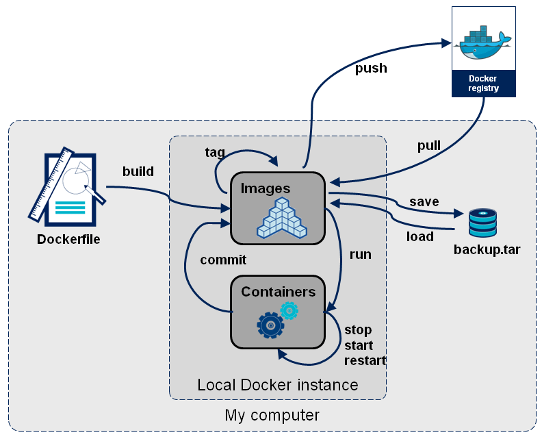

# Container virtualization: Docker

Although you have used Docker in various courses (System Engineering Labs, Operating systems, ...) during the past years, it can't hurt to freshen up your knowledge.

## Requirements

Go through the theory sources provided below (or find your own) to achieve the following requirements:

-   You understand the difference between containers and virtual machines, and know the pro's and con's of each.
-   You understand the role of Docker in containerization.
-   You understand the following concepts of Docker:
    -   What is an image?
    -   What is the difference with a container?
    -   What are layers, and why does Docker use them?
    -   What is a Docker registry and why do people use them?
    -   What is a volume?
    -   What is a port mapping?
    -   What is a tag?
    -   What are environment variables?
    -   What is a `Dockerfile`?
-   You can install and use `docker` commands to use all of the concepts above.

    -   In other words: you understand and can use all of the commands in following image:

        

-   You can write a basic `Dockerfile`.
-   You can build Docker images and run them as Docker containers.
-   You can push and pull Docker images to and from a Docker registry like DockerHub.
-   You understand the role of Docker Compose in containerization.
    -   When do we use Docker Compose instead of just Docker?
-   You understand the following concepts of Docker Compose:
    -   What is a `docker-compose.yml`?
    -   How DNS works inside a single `docker-compose.yml` (e.g. how you can access another container from a container).
-   You can install `docker compose` and know how to start, stop, and update a Docker Container stack using `docker compose` commands.
-   You can view the logs generated by a Docker Compose stack.

## Theory

### Articles

-   Historical context for Kubernetes: https://kubernetes.io/docs/concepts/overview/#going-back-in-time
    -   Bare metal vs. virtual machines vs. containers and how we got there.
-   Containers vs. VM's: https://www.redhat.com/en/topics/containers/containers-vs-vms

### Videos

-   The Future of Linux Containers: https://youtu.be/wW9CAH9nSLs
    -   At PyCon 2013, Solomon Hykes shows docker to the public for the first time.
-   Docker in 100 Seconds: https://www.youtube.com/watch?v=Gjnup-PuquQ
-   The intro to Docker I wish I had when I started: https://www.youtube.com/watch?v=Ud7Npgi6x8E
-   Docker Tutorial for Beginners: https://www.youtube.com/watch?v=b0HMimUb4f0
-   Docker Crash Course playlist: https://www.youtube.com/watch?v=31ieHmcTUOk&list=PL4cUxeGkcC9hxjeEtdHFNYMtCpjNBm3h7

### Online manuals

-   Docker: https://docs.docker.com/
-   Docker Compose: https://docs.docker.com/compose/
-   Portainer: https://documentation.portainer.io/

### Online courses

-   Learning Docker, LinkedIn Learning: https://www.linkedin.com/learning/learning-docker-17236240
    - Students of HOGENT get free access to LinkedIn Learning through [Academic Software](https://academicsoftware.eu/login).
-   Introduction to Docker (slides only): https://hogenttin.github.io/docker-intro

### Books

-   McKendrick, R. & Gallagher, S. (2020) _Mastering Docker._ 4th Edition. Packt Publishing. Retrieved on 2023-09-18 from https://www.packtpub.com/product/mastering-docker-fourth-edition/9781839216572
-   Bhat, S., Bhat, S., & Karkal. (2018). _Practical Docker with Python_. Bangalore: Apress. Retrieved on 2023-09-18 from https://link.springer.com/book/10.1007/978-1-4842-3784-7
