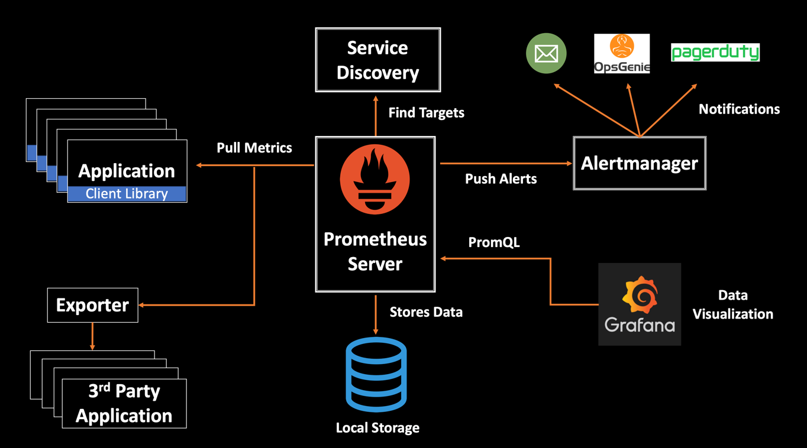

# Monitoring

## Requirements

-   You understand what monitoring is, and why it is necessary.
-   You understand the difference between metrics and logs.
-   You understand what alerting is.
-   You understand what alerting fatigue is.
    -   You understand that fine-tuning alerts to achieve the right balance is crucial and constitutes the most significant effort when setting up a monitoring solution.
-   You understand the roles and interactions of Exporters, Prometheus, Grafana, and Alert Manager.

    -   E.g. you can explain the following image:

        

-   You can export metrics from a python script or a virtual machine.
-   You can set up a Grafana Dashboard to see a live graph of such metrics.
-   You can set up alerting in Alert Manager and push these to a communication software of choice (e.g. Discord, Teams, Matrix.org, etc.) when certain situations happen.

## Theory

### Articles

-   Prometheus Monitoring: The Definitive Guide in 2019: https://devconnected.com/the-definitive-guide-to-prometheus-in-2019/
    -   Contains visuals that clarify key concepts.
    -   Although written in 2019, it is still relevant.
-   Awesome Prometheus alerts: https://samber.github.io/awesome-prometheus-alerts/rules.html
    -   Contains a lot of examples of alert rules for Alert Manager.
    -   :warning: If you use a rule definition of this repo, don't just blindly copy-paste: make sure you understand what it does!

### Videos

-   Introduction to the Prometheus Monitoring System | Key Concepts and Features: https://www.youtube.com/watch?v=STVMGrYIlfg
-   How Prometheus Monitoring Works | Explaining Prometheus Architecture | KodeKloud: https://www.youtube.com/watch?v=f4W_eEJC-20
-   How To Install Prometheus And Grafana On Docker: https://www.youtube.com/watch?v=jj38y6f6UpE
-   Effortless Server Monitoring: Install Grafana, Prometheus & Node Exporter with Docker!: https://www.youtube.com/watch?v=yrscZ-kGc_Y
-   How to send Alerts in Prometheus - Alertmanager: https://www.youtube.com/watch?v=bchNRQQkSjM
-   Creating a Discord Bot for Prometheus Alerts | Node Application Monitoring part 4: https://www.youtube.com/watch?v=8s0hic3XusA
-   Observability vs Monitoring vs APM vs Logging vs Alerting: https://www.youtube.com/watch?v=TYE2u7QZNVA
-   Understanding Alert Fatigue: https://www.youtube.com/watch?v=CN_sRMtMPmk
-   What Are the Dangers of Alert Fatigue? https://www.youtube.com/watch?v=juitFz2eJHc
    -   Alert fatigue also happens in non-IT branches, such as health care, and can have serious consequences.
-   The More You Monitor - 9 Steps to Prevent Alert Storms: https://www.youtube.com/watch?v=FfpBGATG_6c
-   Prometheus: The Documentary: https://www.youtube.com/watch?v=rT4fJNbfe14
    -   The journey of open-source monitoring system, Prometheus. This explores the story of Prometheus, from inception to adoption as told by the story’s key players.

### Online manuals

-   Prometheus and Alertmanager: https://prometheus.io/docs/introduction/overview/
-   Grafana: https://grafana.com/docs/

### Online courses

-   DevOps Foundations: Monitoring and Observability, Linkedin Learning:
    https://www.linkedin.com/learning/devops-foundations-monitoring-and-observability/
    -   Students of HOGENT get free access to LinkedIn Learning through [Academic Software](https://academicsoftware.eu/login).
